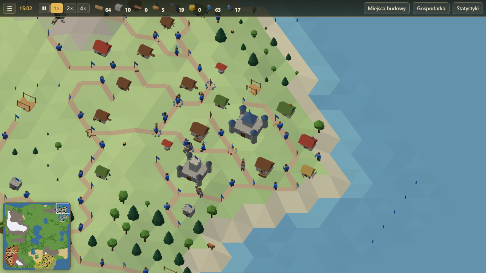

# Osadnicy Doliny

Przeglądarkowa gra ekonomiczno-strategiczna 3D w duchu klasycznych gier o budowaniu osad:
gospodarka oparta na **drogach, flagach i tragarzach**, długie łańcuchy produkcji, granice wyznaczane
przez budynki wojskowe i pojedynki rycerzy. Gra z botami albo **multiplayer P2P dla 2–8 graczy**.



**Zagraj:** <https://lagsters.github.io/Villagers/>

## Co jest w grze

- **Transport jak w oryginale:** drogi między flagami, jeden tragarz na odcinek, kolejki towarów na
  flagach, osły na zatłoczonych drogach, drogi wodne z łodziami, priorytety transportu.
- **31 budynków i pełne łańcuchy** (poziom drugiej części serii): drewno, kamień, zboże, mąka, chleb,
  woda, piwo, świnie i mięso, węgiel (kopalnie i smolarnie), żelazo, złoto i monety, 12 narzędzi, broń,
  łodzie, osły; chaty, domy i duże budynki z wyrównywaniem terenu; geolog.
- **Ustawienia gospodarki:** rozdział jedzenia, desek, żelaza, węgla, zboża i wody; priorytety narzędzi;
  obsada budynków wojskowych; wstrzymywanie produkcji.
- **Wojsko:** rycerze z 5 poziomami (szkolenie monetami), morale, atak i obrona, przejmowanie budynków,
  płonące budynki na utraconym terenie, katapulty. Wygrywa ten, kto zdobędzie zamki przeciwników.
- **Boty** na dwóch poziomach trudności — grają przez te same komendy co człowiek.
- **Multiplayer P2P** przez WebRTC z deterministycznym lockstepem, lobby z kodem pokoju, wykrywanie
  desynchronizacji, przejęcie osady przez bota po rozłączeniu gracza.
- **Stylizowana grafika low-poly** (wszystkie modele generowane skryptami Blendera), animacje,
  dźwięki syntetyzowane w przeglądarce, minimapa, statystyki z wykresami, samouczek, zapis gry z botami.
- **Lekka:** działa płynnie na zintegrowanej grafice; automatycznie dobiera jakość na słabym sprzęcie.

## Sterowanie

- **Kliknięcie pola** — panel z możliwymi akcjami (flaga, budynki, droga, atak).
- **Przeciąganie** (mysz albo palec) — przesuwanie widoku; **kółko / szczypanie** — zoom;
  **Q / E** — obrót o 60°; **WASD / strzałki** — przesuwanie.
- **B** — pokaż miejsca pod budowę; **spacja** — pauza (gra z botami); **Esc** — anuluj.
- Budowa drogi: kliknij flagę → „Buduj drogę” → kliknij cel (flagę albo wolne pole).

## Uruchomienie lokalne

Wymagany Node.js ≥ 22.18 (TypeScript uruchamiany natywnie).

```bash
npm install
```

```bash
npm run dev
```

Gra wieloosobowa lokalnie — w drugim terminalu serwer sygnalizacyjny:

```bash
npm run server
```

## Testy

```bash
npm test
```

```bash
npm run test:e2e
```

```bash
npm run test:perf
```

- `npm test` — symulacja (mechaniki, determinizm, zapis/odczyt), 20 pełnych partii bot kontra bot,
  8 peerów lockstepu na symulowanej sieci z opóźnieniami i utratą pakietów, serwer sygnalizacyjny,
  modele (budżety trójkątów, wczytywanie `.glb`).
- `npm run test:e2e` — Playwright (Chromium, Firefox): start gry, budowa przez UI, lobby z dwiema kartami.
- `npm run test:perf` — 8 graczy po 30 minutach gry, CPU ×4, 1280×720.
- `npm run bots` — 20 partii botów z logiem statystyk.

## Modele 3D

Modele powstają wyłącznie ze skryptów Pythona dla Blendera (`art/scripts/`); pliki `.glb`, podglądy
i ikony są generowane:

```bash
npm run art
```

(ścieżkę do Blendera można podać w zmiennej `BLENDER`).

## Struktura

```
sim/     deterministyczna symulacja (liczby całkowite, własny PRNG, zero DOM)
net/     WebRTC, lockstep, klient sygnalizacji
client/  rendering three.js, interfejs, wejście, dźwięk
ai/      boty i narzędzia do partii testowych
server/  serwer sygnalizacyjny, konfiguracja coturn i Caddy, install.sh
art/     skrypty Blendera, wygenerowane modele, podglądy, ikony
tests/   testy jednostkowe, sieciowe, e2e, wydajnościowe
docs/    GDD, decyzje, postęp prac, instrukcja publikacji
```

## Publikacja

Instrukcja krok po kroku (GitHub Pages, darmowa domena DuckDNS, serwer na Oracle Cloud Free Tier):
[docs/DEPLOY.md](docs/DEPLOY.md).

## Licencja

Kod i zasoby (modele, ikony, dźwięki generowane w kodzie): [MIT](LICENSE).
Gra jest samodzielnym projektem inspirowanym mechanikami klasycznych gier ekonomicznych; nie zawiera
żadnych zasobów, tekstów ani map z innych gier.
