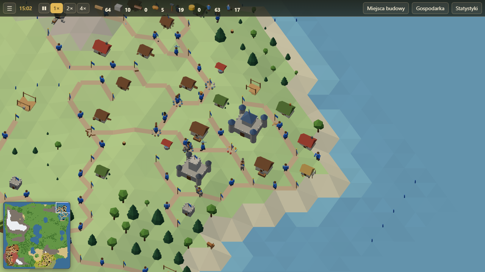

# Osadnicy Doliny

Przeglądarkowa gra ekonomiczno-strategiczna 3D w duchu klasycznych gier o budowaniu osad:
gospodarka oparta na **drogach, flagach i tragarzach**, długie łańcuchy produkcji, granice wyznaczane
przez budynki wojskowe i pojedynki rycerzy. Gra z botami albo **multiplayer P2P dla 2–8 graczy**.



**Zagraj:** <https://lagsters.github.io/Villagers/>

## Co jest w grze

- **Transport jak w oryginale:** drogi między flagami, jeden tragarz na odcinek, kolejki towarów na
  flagach, osły na zatłoczonych drogach, drogi wodne z łodziami, priorytety transportu.
- **31 budynków i pełne łańcuchy** (poziom drugiej części serii): drewno, kamień, zboże, mąka, chleb,
  woda, piwo, świnie i mięso, węgiel (kopalnie i smolarnie), żelazo, złoto i monety, 12 narzędzi, broń,
  łodzie, osły; chaty, domy i duże budynki z wyrównywaniem terenu; geolog.
- **Ustawienia gospodarki:** rozdział jedzenia, desek, żelaza, węgla, zboża i wody; priorytety narzędzi;
  obsada budynków wojskowych; wstrzymywanie produkcji.
- **Wojsko:** rycerze z 5 poziomami (szkolenie monetami), morale, atak i obrona, przejmowanie budynków,
  płonące budynki na utraconym terenie, katapulty. Wygrywa ten, kto zdobędzie zamki przeciwników.
- **Boty** na dwóch poziomach trudności — grają przez te same komendy co człowiek.
- **Multiplayer P2P** przez WebRTC z deterministycznym lockstepem, lobby z kodem pokoju, wykrywanie
  desynchronizacji, przejęcie osady przez bota po rozłączeniu gracza.
- **Stylizowana grafika low-poly** (wszystkie modele generowane skryptami Blendera), animacje,
  dźwięki syntetyzowane w przeglądarce, minimapa, statystyki z wykresami, samouczek, zapis gry z botami.
- **Lekka:** działa płynnie na zintegrowanej grafice; automatycznie dobiera jakość na słabym sprzęcie.

## Jak wygląda świat

- **Teren malowany w shaderze** (`client/render/terrain.ts`): trawa, piasek, skała, śnieg i woda z własnymi
  fakturami; granice rodzajów falują niezależnie od siatki. Trawa ma łaty, przesuszenie na wzgórzach i kwiaty,
  skała - garby, głazy, mech na półkach i piarg, śnieg - zaspy, piasek - wydmy i mokry pas przy wodzie. Woda
  faluje i błyska, przy brzegu prześwituje dno i faluje piana; leży tylko na poziomie swojego lustra (jezioro
  może być wyżej niż morze), nie na zboczach.
- **Ziemia reaguje na to, co na niej stoi** (stan pól w teksturze, `client/render/cells.ts`): cienie drzew,
  budynków i skał, ściółka w lesie, wydeptana ziemia przy budynkach i flagach, drogi z koleinami, ścieżka od
  flagi pod same drzwi budynku (albo pod schody), zaorane pola z bruzdami.
- **Kula ziemska**: świat zakrzywia się z odległością od środka widoku (`client/render/curve.ts`) - przy mocno
  pochylonej kamerze daleki ląd i morze opadają za horyzont, nad nim widać niebo (`client/render/ocean.ts`).
- **Teren generowany z kodu mapy**: łąki, pustynie, góry ze złożami, śnieg, jeziora i morze; przy każdym zamku
  łagodne wzniesienie górskie z węglem, żelazem i złotem.
- **Natura** (`art/scripts/nature.py`): po dwie odmiany drzew iglastych, liściastych i skał, pola z rzędami
  kłosów, płynny wzrost sadzonek i zboża, kępy trawy, krzaki, trzcina na brzegach, drobne kamienie w górach.
- **Budynki na stoku**: stoją na średniej wysokości terenu pod obrysem; od dołu schodzi do terenu szara
  podmurówka, przed drzwiami - kamienne schody, gdy próg jest wyżej niż teren. Sprzęty przed budynkiem
  (pieńki, płoty, beczki, kłody) i ziemia placu budowy leżą na terenie. Każdy zawód ma własną animowaną scenę pracy.
- **Zwierzęta i tragarze**: świnki w chlewni ryją, rozglądają się, taplają w błocie i ocierają o płot, a na karmienie
  biegną do koryta; tragarze niosą lekkie towary na głowie, pnie i deski na ramieniu, ciężkie oburącz, wiadro
  w ręce, a bez pracy przestępują, rozglądają się, przeciągają, wypatrują albo siadają. Postacie mają łokcie
  i dłonie - ręce zginają się przy chodzie, noszeniu i pracy.
- **Mapa świata botów** (`DOLINA`, rozmiar 64) ma ręczne poprawki położenia wzniesienia z kopalniami i jeziora
  (`MAP_TWEAKS` w `sim/mapgen.ts`); pozostałe mapy powstają w całości z kodu.

## Dźwięk

Wszystkie dźwięki powstają w przeglądarce (WebAudio, bez plików): generatory w `client/sfx.ts`, silnik
w `client/audio.ts`; głośność ogólna w ustawieniach menu.
- **Dźwięki świata mają położenie.** Słuchacz stoi w środku widoku: im większe przybliżenie i im bliżej środka
  ekranu jest źródło, tym głośniej i wyraziściej (z daleka filtr przycina górę pasma i rośnie pogłos); panorama
  stereo wg położenia na ekranie; poza kadrem cisza. Najwyżej 18 dźwięków naraz, 3 jednakowe naraz i 10 pętli.
- **Praca zawodów brzmi w chwili uderzenia**: siekiera, trzask i upadek drzewa, piła, kilof i dłuto, łopata
  i ziemia, młotek, kowadło, syk hartowania, ogień pieców, kuźni i mielerza, skrzypienie wiatraka i kołowrotu
  studni, plusk wiadra, lanie wody i paszy, bulgotanie kadzi, tasak, stempel mincerza, kosa, sianie, cięciwa
  i trafienie, spławik i ryba, wiosła, zsyp urobku, katapulta, miecz o tarczę, pożar. Tragarz stawiający towar
  na ziemi stuka wg towaru (drewno, kamień, metal, worek).
- **Zwierzęta i ludzie**: świnie chrząkają (częściej przy korycie) i kwiczą, biegnąc do koryta; osioł ryczy
  w hodowli i z rzadka na drodze, stuka kopytami; jeleń prycha, gdy podchodzi myśliwy; rycerze krzyczą
  w pojedynku i przy upadku. Głosy są syntetyzowane; gra losuje tylko spośród wariantów zatwierdzonych na
  odsłuchu (`PICKS` w `client/sfx.ts`), a bez wpisu - z całej przestrzeni parametrów.
- **Otoczenie** mieszane wg kadru (co 0,5 s): wiatr (z góry głośniej), szum lasu, morze, jezioro, gwar osady
  przy wielu osadnikach, ptaki nad lasem i trawą, świerszcze na łąkach. To najniższy priorytet: tło gra cicho
  i przycisza się jeszcze (do ok. 1/3), gdy słychać pracę, zwierzęta albo ogień i wodę.
- Powiadomienia bez położenia: klik, postawienie budowy, budynek gotowy, atak, przejęcie, utrata zamku, koniec gry.

## Zasady stawiania budynków

- Chata: trawa na polu, sąsiedzi nie w wodzie ani w śniegu, żaden sąsiad nie wyżej ani niżej o więcej niż
  1 stopień wysokości. Chatę można też postawić wszędzie tam, gdzie wolno postawić dom - na stromszym stoku
  najpierw przychodzi kopacz i wyrównuje teren, więc chata nie stoi na wysokiej podmurówce. Boty stawiają chaty
  tylko na łagodnym stoku.
- Dom i duży budynek: trawa wokół, brak budynków na 6 sąsiednich polach i domów w drugim pierścieniu, różnica
  wysokości w drugim pierścieniu < 9; kopacz wyrównuje pole i 6 sąsiadów przed budową.
- Kopalnia: góry na polu. Flagi nie mogą sąsiadować.
- Drogi: przez wolne pola i przez drzewa (drzewo zostaje, droga omija je łukiem; boty prowadzą drogi tylko po
  wolnych polach); na polu z drzewem nie da się postawić flagi. Przy budynkach droga odsuwa się łukiem od ścian. Szczegóły i uzasadnienia: `docs/DECISIONS.md`.

## Sterowanie

- **Kliknięcie pola** — panel z możliwymi akcjami (flaga, budynki, droga, atak).
- **Przeciąganie** (mysz albo palec) — przesuwanie widoku; **kółko / szczypanie** — zoom (kółkiem do punktu pod kursorem, do 10×);
  **WASD / strzałki** — przesuwanie.
- **Przeciąganie prawym (lub środkowym) przyciskiem** — swobodny obrót kamery (w bok) i pochylenie
  (w górę/dół, od 10° nad horyzontem do 80°); **Q / E** — obrót o 60°; **R / F** — pochylenie; **Home** — widok domyślny;
  na dotyku **skręt dwoma palcami** obraca widok.
- **B** — pokaż miejsca pod budowę; **spacja** — pauza (gra z botami); **Esc** — anuluj.
- Budowa drogi: kliknij dwukrotnie flagę (albo flaga → „Buduj drogę”), potem klikaj kolejne kropki,
  żeby prowadzić drogę krok po kroku (zielone kropki pokazują możliwe kroki), albo od razu kliknij dalekie
  pole lub flagę - droga dociągnie się najkrótszą trasą. Klik na fladze lub drodze kończy, ponowny klik na
  końcu stawia tam flagę; prawy przycisk / Backspace cofa krok, Esc przerywa.

## Uruchomienie lokalne

Wymagany Node.js ≥ 22.18 (TypeScript uruchamiany natywnie).

```bash
npm install
```

```bash
npm run dev
```

Gra startuje z menu. Szybki start i podgląd przez parametry adresu (nie zapisują opcji):

- `?map=DOLINA&size=64&players=2&seed=5` — od razu partia na mapie z kodu (gracz 0 to człowiek, reszta boty);
  `&ai=2` — poziom botów, `&allbots=1` — wszystkimi graczami sterują boty (np.
  `http://localhost:5173/?map=DOLINA&size=64&players=2&ai=2&allbots=1&seed=5`).
- `?demo=1` — pokaz wszystkich zawodów przy pracy w małej dolinie (panel „Pokaz zawodów”), `&notour` — bez panelu.
- `&quality=low`, `&fps=30` — jakość grafiki i limit klatek.

Gra wieloosobowa lokalnie — w drugim terminalu serwer sygnalizacyjny:

```bash
npm run server
```

### Gra wieloosobowa przez internet

Na `https://lagsters.github.io/Villagers/` lobby działa przez serwer `wss://api.kwasnypp.ovh/osada/`:

1. Gospodarz: **Gra wieloosobowa** → imię → **Utwórz pokój** — pojawia się 6-znakowy kod pokoju.
2. Pozostali (do 8 graczy, także na innych komputerach i telefonach): **Gra wieloosobowa** → imię → kod →
   **Dołącz** → **Jestem gotowy**.
3. Gospodarz: **Rozpocznij grę**.

Na jednym komputerze drugi gracz to okno incognito. Wszyscy muszą mieć tę samą wersję strony (po aktualizacji gry
odświeżyć). Bez przekaźnika TURN gracz za restrykcyjną siecią (część sieci firmowych i komórkowych) widzi lobby,
ale partia mu nie startuje (`docs/DEPLOY.md`).

## Testy

```bash
npm test
```

```bash
npm run test:e2e
```

```bash
npm run test:perf
```

- `npm test` — symulacja (mechaniki, determinizm, zapis/odczyt), 20 pełnych partii bot kontra bot,
  8 peerów lockstepu na symulowanej sieci z opóźnieniami i utratą pakietów, serwer sygnalizacyjny,
  modele (budżety trójkątów, wczytywanie `.glb`).
- `npm run test:e2e` — Playwright (Chromium, Firefox): start gry, budowa przez UI, lobby z dwiema kartami.
- `npm run test:perf` — 8 graczy po 30 minutach gry, CPU ×4, 1280×720.
- `npm run bots` — 20 partii botów z logiem statystyk.
- `bash scripts/check.sh` — bramka przed commitem: ESLint, TypeScript, wszystkie testy Vitest (w tym 20 partii
  botów - każda musi skończyć się zwycięstwem, a trudny bot wygrać co najmniej 10).

## Jak gra jest rozwijana i sprawdzana autonomicznie

Zmiany wprowadza agent (Claude Code) według zasad w [CLAUDE.md](CLAUDE.md); każdy krok kończy się sprawdzeniem
bez udziału człowieka:

1. **Symulacja** (`sim/`) jest deterministyczna: te same komendy dają ten sam stan na każdym komputerze (lockstep
   sieciowy, zapis gry, powtórki). Zmiana zasad podnosi `SIM_VERSION` (`sim/version.ts`) i musi przejść 20 partii
   bot kontra bot. Testy scenariuszowe w `tests/sim/` sprawdzają mechaniki, determinizm (dwie instancje, zapis
   i odczyt w połowie partii) i zasady stawiania.
2. **Modele** powstają ze skryptów Blendera (`node art/build.ts <katalog> [nazwy]`); test `tests/art/` pilnuje,
   że każdy wymagany model istnieje, ma podgląd i mieści się w budżecie trójkątów.
3. **Wygląd** sprawdzany jest zdjęciami z gry w przeglądarce bez okna: `node scripts/capture.ts --out <katalog>`
   (opcje w nagłówku skryptu: przewinięcie gry, kamera na budynek albo pole, zoom, obrót, klatki animacji),
   arkusz klatek `python scripts/sheet.py <katalog>`, animacja `python scripts/anim.py <katalog> plik.webp`.
   Porównania przed/po robi się z dwóch serwerów (stan sprzed zmiany i po) z tych samych ujęć.
4. **Interfejs** sprawdzają testy Playwright (`npx playwright test tests/e2e --project=chromium`): start gry,
   budowa budynku i drogi prawdziwymi kliknięciami, lobby dwóch kart.
5. **Dźwięki**: agent wstępnie odsiewa warianty pomiarami i spektrogramami, a o tym, co gra, decyduje odsłuch
   właściciela - procedura w punkcie „Odsłuch dźwięków” niżej.
6. Decyzje projektowe i ich powody trafiają do `docs/DECISIONS.md`, postęp - do `docs/PROGRESS.md`, a opis
   tego, co gra robi i jak ją uruchomić i sprawdzić - do tego README.

## Odsłuch dźwięków

Powtarzamy go po każdej zmianie generatora dźwięku w `client/sfx.ts` (to samo ziarno brzmi wtedy inaczej) i po
dodaniu nowego dźwięku. Agent nie słyszy, więc dzieli pracę z właścicielem:

1. **Warianty** (agent, serwer gry musi działać, potrzebny ffmpeg):
   `node scripts/sounds.ts --out <katalog> [--names pig_grunt,bird] [--n 100] [--top 6]`.
   Każdy dźwięk jest renderowany offline w przeglądarce bez okna dla wielu ziaren. Głosy (zwierzęta, ptaki, okrzyki)
   dostają po `--n` ziaren: skrypt mierzy cechy nagrania (długość, wysokość tonu, udział dźwięczności, barwa),
   porównuje je ze wzorcem prawdziwego odgłosu (`TARGETS` w skrypcie) i wybiera `--top` najlepszych, możliwie
   różnych. Dźwięki pracy dostają po 3 ziarna bez rankingu, a pętle po 4 sekundy. Ziarna już zatwierdzone (`PICKS`)
   są zawsze dołączane, żeby porównać je z nowymi. Wynik to `<katalog>/<dźwięk>_<ziarno>.mp3`, `.png` (spektrogram)
   i `sounds.json`.
2. **Przegląd spektrogramów** (agent): obejrzeć png wybranych wariantów (np. trzaski, przesterowanie, cisza)
   i poprawić generator przed pokazaniem właścicielowi.
3. **Strona odsłuchu** (agent): `python scripts/sounds-page.py <katalog>` składa `<katalog>/index.html`
   (odtwarzacze z falą, mp3 wbudowane w stronę). Agent publikuje ją jako artefakt z bazą (`capabilities: {"db": {}}`)
   i podaje link.
4. **Wybór** (właściciel): odsłuchuje i zaznacza „dobre” przy wariantach, które mają grać. Warianty oznaczone
   „w grze” są wstępnie zaznaczone. Zaznaczenia zapisują się w bazie artefaktu (kolekcja `picks`, dokument na
   dźwięk z polem `seeds`).
5. **Wpis do gry** (agent): odczytuje kolekcję `picks` i przepisuje ją do `PICKS` w `client/sfx.ts`. Gra losuje
   tylko spośród wpisanych ziaren. Gdy przy dźwięku zaznaczono wszystkie pokazane nowe warianty, wpisu nie ma, bo
   cała przestrzeń brzmi dobrze i zostaje pełna różnorodność. Dźwięk bez żadnego zaznaczenia zachowuje dotychczasowy
   wpis (albo jego brak), a agent pyta właściciela, czy generator poprawić.

## Modele 3D

Modele powstają wyłącznie ze skryptów Pythona dla Blendera (`art/scripts/`); pliki `.glb`, podglądy
i ikony są generowane:

```bash
npm run art
```

(ścieżkę do Blendera można podać w zmiennej `BLENDER`).

## Struktura

```
sim/     deterministyczna symulacja (liczby całkowite, własny PRNG, zero DOM)
net/     WebRTC, lockstep, klient sygnalizacji
client/  rendering three.js, interfejs, wejście, dźwięk
ai/      boty i narzędzia do partii testowych
server/  serwer sygnalizacyjny (lobby gry wieloosobowej)
art/     skrypty Blendera, wygenerowane modele, podglądy, ikony
tests/   testy jednostkowe, sieciowe, e2e, wydajnościowe
docs/    GDD, decyzje, postęp prac, instrukcja publikacji
```

## Publikacja

Strona gry na GitHub Pages, serwer lobby na `api.kwasnypp.ovh` (Oracle Cloud, konfiguracja w prywatnym
repozytorium `pkwasny/vps01`): [docs/DEPLOY.md](docs/DEPLOY.md).

## Licencja

Kod i zasoby (modele, ikony, dźwięki generowane w kodzie): [MIT](LICENSE).
Gra jest samodzielnym projektem inspirowanym mechanikami klasycznych gier ekonomicznych; nie zawiera
żadnych zasobów, tekstów ani map z innych gier.
